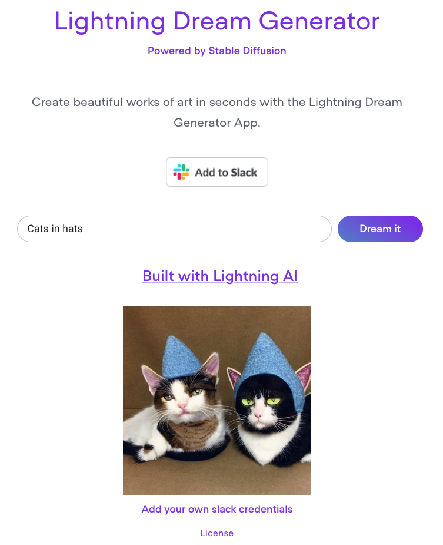

# LAI-stable-diffusion-App

  
   
  <strong>Visualize your words with Stable Diffusion Lightning App</strong>
   
  
This thumbnail is generated with Stable Diffusion

---

This App can generate images from text prompts. Get creative and generate some art!

## Getting started

### Installation

Login to [Lightning.AI App Gallery](https://lightning.ai), then go to the Stable Diffusion app and clone & run the app.
